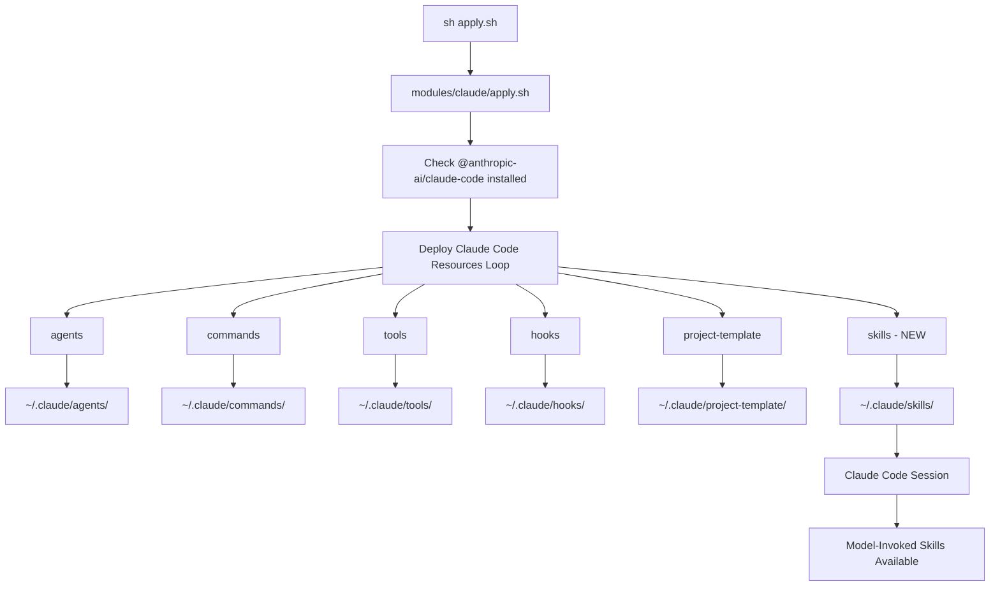

# Claude Skills Integration Design Document

## Overview

This design document outlines the integration of Claude Skills into the macOS dotfiles management system. Skills are model-invoked capabilities that Claude autonomously activates based on task context, complementing the existing user-invoked slash commands and sub-agents infrastructure. This integration will enable user-level Skills deployment to `~/.claude/skills/` through the existing claude module deployment infrastructure.

## Background and Context

### Prerequisite ADRs

No prerequisite ADRs required. This is an additive feature that extends the existing Claude Code resource deployment pattern without modifying existing architecture.

### Agreement Checklist

#### Scope
- [x] Add Skills directory support to modules/claude/apply.sh deployment loop
- [x] Create user-level Skills deployment to ~/.claude/skills/
- [x] Provide example Skills or templates for users
- [x] Maintain consistency with existing resource deployment patterns (agents, commands, tools, hooks, project-template)

#### Non-Scope (Explicitly not changing)
- [x] Project-level Skills deployment (.claude/skills/) - handled manually by users via git
- [x] Existing resource deployment logic (agents, commands, tools, hooks, project-template)
- [x] MCP server configuration
- [x] Claude Desktop config.json generation
- [x] Module dependency resolution system

#### Constraints
- [x] Parallel operation: Skills must work alongside existing commands/agents/tools
- [x] Backward compatibility: Must not break existing deployments
- [x] Performance measurement: Not required (file copy operations)

### Problem to Solve

The macOS dotfiles system currently deploys agents, commands, tools, hooks, and project-template to `~/.claude/`, but does not support Skills deployment. Users who want to leverage Claude's model-invoked capabilities must manually create and manage Skills directories, leading to:

1. Inconsistent Skills availability across machines
2. Manual synchronization burden
3. Missed opportunity to provide curated Skills for dotfiles workflows
4. Gap in the otherwise comprehensive Claude Code resource deployment system

### Current Challenges

1. **Missing Deployment Infrastructure**: No automated way to deploy Skills to ~/.claude/skills/
2. **No User Guidance**: Users unaware of Skills vs Commands distinction
3. **Consistency Gap**: All other Claude Code resources are automatically deployed except Skills
4. **Discoverability**: Without example Skills, users don't know what's possible

### Out of Scope

This design explicitly does NOT include:

1. **Project-Level Skills Deployment**: .claude/skills/ for project-specific skills (users handle via git)
2. **Skills Marketplace**: Curated collection of pre-built skills (may be future enhancement)
3. **Skill Validation**: Automated validation of SKILL.md frontmatter format
4. **Skill Testing Framework**: Automated testing of skill effectiveness
5. **Skill Analytics**: Tracking which skills Claude invokes
6. **Skills Discovery UI**: Interface for browsing available skills
7. **Skills Documentation Generator**: Auto-generate docs from SKILL.md files
8. **Backward Compatibility Layer**: No existing skills to migrate
9. **Custom Skill CLI**: No new commands like /skills:create (users create manually)
10. **Skill Packaging**: No distribution mechanism beyond git

### Requirements

#### Functional Requirements

1. **Skills Deployment**: Deploy Skills from modules/claude/skills/ to ~/.claude/skills/
2. **Directory Structure Support**: Handle nested directory structure (each skill is a directory with SKILL.md + supporting files)
3. **Cleanup Mode**: Support cleanup mode like other resources (remove old skills before deployment)
4. **Permissions**: Set appropriate permissions for any executable supporting files
5. **Example Skills**: Provide at least one example or template skill

#### Non-Functional Requirements

- **Performance**: File copy operations should complete within existing deployment timeframe (<5 seconds)
- **Scalability**: Support deployment of 10-50 skills without performance degradation
- **Reliability**: Failed skill deployment should not break other resource deployments
- **Maintainability**: Code should follow existing patterns in apply.sh for easy maintenance

## Acceptance Criteria (AC)

- [ ] When user runs `sh modules/claude/apply.sh` with @anthropic-ai/claude-code installed, Skills are deployed to ~/.claude/skills/
- [ ] When Skills directory exists at modules/claude/skills/, all subdirectories are copied to ~/.claude/skills/
- [ ] When cleanup mode is enabled, old skills in ~/.claude/skills/ are removed before deployment
- [ ] When skills contain executable files (.sh, .py), they receive executable permissions
- [ ] When deployment completes, user sees "skills deployed" success message
- [ ] When Claude Code is started, deployed skills are available for model-invoked use
- [ ] When skills directory does not exist at modules/claude/skills/, deployment continues without error
- [ ] When multiple skills exist, each maintains its own directory with SKILL.md and supporting files

## Existing Codebase Analysis

### Implementation Path Mapping
| Type | Path | Description |
|------|------|-------------|
| Existing | modules/claude/apply.sh:243-266 | Resource deployment loop for agents/commands/tools/hooks/project-template |
| Existing | modules/claude/agents/ | Agent definitions (11 agents) |
| Existing | modules/claude/commands/ | Slash commands |
| Existing | modules/claude/tools/ | Custom tools (if exists) |
| Existing | modules/claude/hooks/ | Git hooks (if exists) |
| Existing | modules/claude/project-template/ | Project initialization templates (if exists) |
| New | modules/claude/skills/ | Skills directory to be created |
| Existing | ~/.claude/agents/ | Deployment target for agents |
| Existing | ~/.claude/commands/ | Deployment target for commands |
| New | ~/.claude/skills/ | Deployment target for skills |

### Current System Integration Points

**Integration Point 1: Resource Deployment Loop**
- **Location**: modules/claude/apply.sh lines 243-266
- **Current Implementation**: Iterates over `agents commands tools hooks project-template`
- **New Implementation**: Add `skills` to the iteration list
- **Invocation Method**: Automatic during `sh modules/claude/apply.sh` execution
- **Impact Level**: Low (additive only, no changes to existing resources)

**Integration Point 2: Directory Copy Operations**
- **Location**: modules/claude/apply.sh line 256
- **Current Implementation**: `cp -r "$resource_dir"/* "$CLAUDE_CODE_SETTINGS_DIR/$resource_type/"`
- **New Implementation**: Same pattern applies to skills (each skill is a directory)
- **Invocation Method**: Standard cp command
- **Impact Level**: Low (read-only operation on source, write to new target)

**Integration Point 3: Executable Permissions**
- **Location**: modules/claude/apply.sh lines 259-262
- **Current Implementation**: Sets +x for tools and hooks
- **New Implementation**: Add skills to the conditional
- **Invocation Method**: chmod command
- **Impact Level**: Low (permissions only affect new files)

## Design

### Change Impact Map

```yaml
Change Target: modules/claude/apply.sh resource deployment loop
Direct Impact:
  - modules/claude/apply.sh (line 243: add "skills" to resource list)
  - modules/claude/apply.sh (line 259: add "skills" to permissions conditional)
  - modules/claude/skills/ (new directory to be created)
Indirect Impact:
  - ~/.claude/skills/ (new deployment target)
  - Claude Code session startup (Skills become available for model invocation)
No Ripple Effect:
  - Existing resource deployments (agents, commands, tools, hooks, project-template)
  - MCP server configuration
  - Claude Desktop config.json
  - Module dependencies
  - Other modules (brew, mise, git, vscode, finder, keyboard, dotfiles)
```

### Architecture Overview

Skills integrate into the existing Claude Code resource deployment architecture as a new resource type, following the established pattern of directory-based resources deployed from modules/claude/ to ~/.claude/.



### Data Flow

```
Deployment Phase:
1. User executes: sh modules/claude/apply.sh
2. Script checks for @anthropic-ai/claude-code installation
3. User confirms Claude Code deployment (if applicable)
4. User selects cleanup mode (optional)
5. Resource deployment loop executes:
   FOR resource_type IN agents commands tools hooks project-template skills:
     IF cleanup_mode AND exists(~/.claude/$resource_type):
       DELETE ~/.claude/$resource_type/*
     IF exists(modules/claude/$resource_type):
       COPY modules/claude/$resource_type/* → ~/.claude/$resource_type/
       IF resource_type IN [tools, hooks, skills]:
         CHMOD +x ~/.claude/$resource_type/**/*.sh
         CHMOD +x ~/.claude/$resource_type/**/*.py
       PRINT "SUCCESS: $resource_type deployed"
6. Deployment complete

Runtime Phase (Claude Code):
1. User starts: claude
2. Claude Code scans ~/.claude/skills/*/SKILL.md
3. Claude loads skill frontmatter (name, description)
4. User makes request matching skill description
5. Claude autonomously invokes skill
6. Skill instructions guide Claude's actions
```

### Integration Boundary Contracts

| Integration Point | Location | Old Implementation | New Implementation | Switching Method |
|-------------------|----------|-------------------|-------------------|------------------|
| Resource Loop | apply.sh:243 | `for resource_type in agents commands tools hooks project-template` | `for resource_type in agents commands tools hooks project-template skills` | Direct addition to list |
| Permissions | apply.sh:259 | `if [ "$resource_type" = "tools" ] \|\| [ "$resource_type" = "hooks" ]` | `if [ "$resource_type" = "tools" ] \|\| [ "$resource_type" = "hooks" ] \|\| [ "$resource_type" = "skills" ]` | Direct addition to conditional |
| Directory Creation | apply.sh:255 | `mkdir -p "$CLAUDE_CODE_SETTINGS_DIR/$resource_type"` | (No change - already handles any resource_type) | N/A (already generic) |
| File Copy | apply.sh:256 | `cp -r "$resource_dir"/* "$CLAUDE_CODE_SETTINGS_DIR/$resource_type/"` | (No change - already handles nested directories) | N/A (already generic) |

### Main Components

#### Component 1: Skills Directory Structure

- **Responsibility**: Store skill definitions with SKILL.md frontmatter and supporting files
- **Interface**: Directory-based filesystem structure
  ```
  modules/claude/skills/
  ├── example-skill/
  │   ├── SKILL.md          # Frontmatter + instructions
  │   ├── template.txt      # Supporting file (optional)
  │   └── helper.sh         # Supporting script (optional)
  └── another-skill/
      └── SKILL.md
  ```
- **Dependencies**: None (filesystem only)

#### Component 2: Deployment Logic Extension

- **Responsibility**: Deploy skills from modules/claude/skills/ to ~/.claude/skills/
- **Interface**: Bash script modifications in apply.sh
- **Dependencies**:
  - Existing cleanup mode flag ($CLEANUP_MODE)
  - Existing resource deployment loop
  - Existing utility functions (print_info, print_success, print_warning)

#### Component 3: Example/Template Skills

- **Responsibility**: Provide reference implementation for users
- **Interface**: SKILL.md files in modules/claude/skills/
- **Dependencies**: None (documentation only)

### Contract Definitions

```yaml
Skill Directory Contract:
  Location: modules/claude/skills/{skill-name}/
  Required Files:
    - SKILL.md: Must contain YAML frontmatter with name and description
  Optional Files:
    - Any supporting files (scripts, templates, reference docs)

Skill SKILL.md Format:
  Frontmatter (YAML):
    name: string (kebab-case, matches directory name)
    description: string (explains when Claude should use this skill)
  Body (Markdown):
    # Skill Name
    ## Instructions
    [Instructions for Claude]
    ## Examples
    [Example usage scenarios]
```

### Data Contract

#### Deployment Script (apply.sh)

```yaml
Input:
  Type: Filesystem state + user confirmation
  Preconditions:
    - @anthropic-ai/claude-code installed
    - modules/claude/skills/ exists (optional)
  Validation: Directory existence checks

Output:
  Type: Filesystem modifications + console messages
  Guarantees:
    - ~/.claude/skills/ created if modules/claude/skills/ exists
    - All skills copied with directory structure preserved
    - Executable permissions set for .sh and .py files
    - Success/failure messages printed
  On Error:
    - Continues with other resources (error is non-fatal)
    - Prints warning if copy fails
    - Returns exit code 0 (deployment continues)

Invariants:
  - Existing resources (agents, commands, etc.) unaffected
  - Cleanup mode behavior consistent across all resources
  - Skills deployment follows same pattern as other resources
```

### State Transitions and Invariants

Not applicable. This is a stateless deployment operation with no state transitions.

### Error Handling

```yaml
Error Scenarios:
  1. modules/claude/skills/ does not exist:
     Action: Skip skills deployment, print info message
     Impact: None (optional resource)
     Logging: No log message (expected condition)

  2. ~/.claude/skills/ creation fails:
     Action: Print error message, continue with deployment
     Impact: Skills not available, other resources unaffected
     Logging: print_error "Failed to create skills directory"

  3. Individual skill copy fails:
     Action: Print warning message, continue with next skill
     Impact: One skill missing, others still deployed
     Logging: print_warning "Some skills files may not have been copied completely"

  4. Permission setting fails:
     Action: Silently continue (2>/dev/null || true suppresses error)
     Impact: Scripts may not be executable, Claude can still read SKILL.md
     Logging: No log message (permissions are best-effort)

  5. @anthropic-ai/claude-code not installed:
     Action: Skip entire Claude Code deployment section
     Impact: No skills deployed (expected behavior)
     Logging: Standard "Claude Code not installed" message

  6. User declines skills cleanup:
     Action: Skip skills cleanup, continue with other resources
     Impact: Old skills remain, may conflict with updated versions
     Logging: print_info "Skipping skills cleanup"

Logging Strategy:
  - Use print_error for critical failures that prevent deployment
  - Use print_warning for partial failures (some files not copied)
  - Use print_info for informational messages (skipping optional steps)
  - Use print_success for successful completion
  - Errors should not halt deployment (|| true pattern ensures continuation)
  - User-facing messages should be clear about impact and next steps
```

### Logging and Monitoring

```bash
# Console output during deployment
print_info "Deploying skills..."
# If cleanup mode enabled:
print_warning "Removing old skills..."
# After successful deployment:
print_success "skills deployed"

# No persistent logging required (deployment is interactive)
```

## Implementation Plan

### Implementation Approach

**Selected Approach**: Horizontal Slice (Layer-based implementation)

**Selection Reason**:
- This is an infrastructure change affecting the deployment layer
- All skills share the same deployment mechanism
- Changes are concentrated in apply.sh and directory structure
- No feature-specific implementation needed
- Foundation must be complete before any skills can be deployed

### Technical Dependencies and Implementation Order

#### Required Implementation Order

1. **Deployment Script Modification**
   - Technical Reason: Foundation for all skills deployment
   - Dependent Elements: All skills depend on this working
   - Files: modules/claude/apply.sh

2. **Example Skills Creation**
   - Technical Reason: Must have deployment infrastructure first
   - Prerequisites: Deployment script must be functional
   - Files: modules/claude/skills/*/SKILL.md

3. **Documentation Update**
   - Technical Reason: Users need guidance after deployment is ready
   - Prerequisites: Implementation and testing complete
   - Files: CLAUDE.md (optional reference update)

### Integration Testing Points

Each integration point requires E2E verification:

**Integration Testing Point 1: Resource Loop Extension**
- Components: apply.sh resource loop → skills deployment
- Verification: Run `sh modules/claude/apply.sh`, confirm "skills deployed" message appears

**Integration Testing Point 2: Cleanup Mode**
- Components: Cleanup mode flag → skills directory removal
- Verification: Deploy skills, enable cleanup mode, redeploy, confirm old skills removed

**Integration Testing Point 3: Claude Code Runtime**
- Components: ~/.claude/skills/ → Claude Code session
- Verification: Start claude, confirm skills appear in model's available capabilities (check via skill invocation test)

### Migration Strategy

No migration needed. This is a new feature with no existing data or behavior to migrate.

**Rollback Plan**: Remove `skills` from resource loop in apply.sh. Existing deployments with skills will remain functional but not receive updates.

## Test Strategy

### Basic Test Design Policy

All test cases derived from acceptance criteria:
- Manual testing during development (deployment scripts)
- Integration testing via actual deployment
- Functional verification via Claude Code session

### Unit Tests

Not applicable. Shell scripts use manual verification.

### Integration Tests

Manual integration testing required:

1. **Fresh Deployment Test**
   - AC: Skills deployed to ~/.claude/skills/
   - Procedure: Delete ~/.claude/skills/, run apply.sh, verify directory created

2. **Cleanup Mode Test**
   - AC: Old skills removed in cleanup mode
   - Procedure: Deploy skills, modify one, enable cleanup, redeploy, verify old version gone

3. **Missing Skills Directory Test**
   - AC: Deployment continues without error
   - Procedure: Rename modules/claude/skills/, run apply.sh, verify no error

4. **Executable Permissions Test**
   - AC: .sh and .py files executable
   - Procedure: Create skill with helper.sh, deploy, verify `ls -l` shows +x

### E2E Tests

1. **Complete Workflow Test**
   - AC: Skills available in Claude Code session
   - Procedure:
     1. Create example skill in modules/claude/skills/test-skill/SKILL.md
     2. Run `sh modules/claude/apply.sh`
     3. Start `claude` session
     4. Make request matching skill description
     5. Verify Claude invokes skill (mentions skill in thinking/response)
   - **Specific Verification Steps**:
     ```bash
     # Step 1: Verify deployment
     ls -la ~/.claude/skills/test-skill/SKILL.md
     # Expected: File exists with correct permissions

     # Step 2: Verify skill is loaded by Claude Code
     # Start a new Claude Code session and observe startup
     claude
     # Look for skill loading messages in console (if available)

     # Step 3: Test skill invocation
     # Make a request that matches the skill's description
     # Example: If skill description is "Use when creating git commits"
     # Request: "Help me create a commit message"

     # Step 4: Verify skill was invoked
     # - Check Claude's response for skill-related content
     # - Look for skill name mentioned in thinking process
     # - Verify behavior matches skill instructions

     # Step 5: Check Claude Code logs (optional)
     tail -n 50 ~/Library/Logs/Claude/mcp*.log | grep -i skill
     # Look for skill invocation events
     ```

2. **Multi-Skill Deployment Test**
   - AC: Multiple skills deployed with directory structure preserved
   - Procedure:
     1. Create 3 skills with different structures
     2. Deploy
     3. Verify all 3 exist in ~/.claude/skills/ with correct structure
   - **Specific Verification Steps**:
     ```bash
     # Verify directory structure
     find ~/.claude/skills -type f -name "SKILL.md"
     # Expected: 3 SKILL.md files listed

     # Verify supporting files preserved
     ls -R ~/.claude/skills/
     # Expected: All subdirectories and files intact

     # Verify executable permissions
     find ~/.claude/skills -name "*.sh" -o -name "*.py" | xargs ls -l
     # Expected: All scripts have executable bit set (-rwxr-xr-x)
     ```

### Performance Tests

Not required. File copy operations are fast (<1 second for typical skill count).

## Security Considerations

1. **Executable Permissions**: Only set +x for .sh and .py files, not arbitrary executables
2. **Source Trust**: Skills come from dotfiles repository (user-controlled)
3. **Claude Code Sandboxing**: Skills run within Claude Code's existing security model
4. **No Network Access**: Skills are documentation files, not executable by the shell directly

## Future Extensibility

### Potential Enhancements

1. **Skill Validation**: Add SKILL.md frontmatter validation during deployment
2. **Skill Marketplace**: Curate collection of useful dotfiles-specific skills
3. **Project-Level Support**: Add /skills:setup command for project-level skills deployment
4. **Skill Testing**: Framework for testing skill effectiveness
5. **Skill Analytics**: Track which skills are actually invoked by Claude

### Extension Points

1. **Additional Resource Types**: Same pattern can be extended for future Claude Code resources
2. **Skill Categories**: Organize skills by category (development, documentation, automation, etc.)
3. **Skill Dependencies**: Skills that reference other skills or require specific tools

## Alternative Solutions

### Alternative 1: Manual Skills Management

- **Overview**: Users manually create ~/.claude/skills/ and copy files
- **Advantages**:
  - No code changes needed
  - Users have full control
- **Disadvantages**:
  - Inconsistent across machines
  - Manual synchronization burden
  - Discoverability problem
- **Reason for Rejection**: Violates dotfiles project principle of automated environment setup

### Alternative 2: Separate Skills Module

- **Overview**: Create new module in modules/skills/ with its own apply.sh
- **Advantages**:
  - Complete separation from claude module
  - Independent deployment
- **Disadvantages**:
  - Breaks logical grouping (skills are Claude Code resources)
  - Adds dependency management complexity
  - Duplicates deployment patterns
  - Users must select two modules for Claude setup
- **Reason for Rejection**: Skills are Claude Code resources, should deploy with other Claude resources

### Alternative 3: Skills as Git Submodule

- **Overview**: Reference external skills repository as git submodule
- **Advantages**:
  - Access to community skills
  - Automatic updates
- **Disadvantages**:
  - Submodule complexity
  - External dependency
  - Version control challenges
- **Reason for Rejection**: Adds complexity, users can manually add external skills if desired

## Risks and Mitigation

| Risk | Impact | Probability | Mitigation |
|------|--------|-------------|------------|
| Skills directory not created | Medium | Low | Add error handling, print clear messages |
| Permissions not set correctly | Low | Low | Test with example skills containing scripts; use recursive find for nested dirs |
| Cleanup mode removes user-created skills | High | Medium | **Add skills-specific cleanup warning with user confirmation before deletion** |
| Skills conflict with commands | Medium | Low | Document naming conventions, Skills and Commands use different namespaces |
| Example skills not useful | Low | Medium | Start with template-skill only, gather user feedback |
| Claude doesn't invoke skills | Medium | Low | Verify skill descriptions are clear and specific |

## References

**Official Documentation:**
- [Claude Code Skills Documentation](https://docs.claude.com/en/docs/claude-code/skills) - Skills architecture and usage patterns (verified 2025-10-22)
- [Anthropic Skills Repository](https://github.com/anthropics/skills) - Example skills collection (verified 2025-10-22)

**Research Findings** (provided by requirement-analyzer):
- Skills are model-invoked (autonomous) vs commands which are user-invoked
- Skills use YAML frontmatter + Markdown format in SKILL.md
- Skills support directory structure with supporting files
- User-level skills: ~/.claude/skills/
- Project-level skills: .claude/skills/

**Related Framework:**
- [Claude Code Workflows](https://github.com/shinpr/claude-code-workflows) - Existing sub-agent framework deployed by this dotfiles project

**Note**: All URLs verified as of 2025-10-22. Skills feature is part of Claude Code's official capabilities.

## Implementation Details

### File Changes Required

#### 1. modules/claude/apply.sh

**Change 1: Add skills to resource loop (line 243)**

```bash
# Before:
for resource_type in agents commands tools hooks project-template; do

# After:
for resource_type in agents commands tools hooks project-template skills; do
```

**Change 2: Add skills to executable permissions (line 259)**

```bash
# Before:
if [ "$resource_type" = "tools" ] || [ "$resource_type" = "hooks" ]; then
    chmod +x "$CLAUDE_CODE_SETTINGS_DIR/$resource_type"/*.sh 2>/dev/null || true
    chmod +x "$CLAUDE_CODE_SETTINGS_DIR/$resource_type"/*.py 2>/dev/null || true
fi

# After:
if [ "$resource_type" = "tools" ] || [ "$resource_type" = "hooks" ] || [ "$resource_type" = "skills" ]; then
    # Use find to handle nested directory structures (skills may have subdirectories with scripts)
    find "$CLAUDE_CODE_SETTINGS_DIR/$resource_type" -type f \( -name "*.sh" -o -name "*.py" \) -exec chmod +x {} \; 2>/dev/null || true
fi
```

**Change 3: Add skills-specific cleanup warning (before cleanup loop)**

```bash
# Add before the cleanup logic in the resource deployment loop:
if [ "$CLEANUP_MODE" = true ] && [ -d "$CLAUDE_CODE_SETTINGS_DIR/skills" ]; then
    print_warning "WARNING: Cleanup will remove ALL skills including any you created manually"
    if ! confirm "Are you sure you want to remove existing skills?"; then
        print_info "Skipping skills cleanup"
        # Skip skills in cleanup by continuing to next iteration when resource_type is "skills"
        # This requires adding a check inside the loop:
        # if [ "$resource_type" = "skills" ] && [ "$SKIP_SKILLS_CLEANUP" = true ]; then continue; fi
    else
        SKIP_SKILLS_CLEANUP=false
    fi
fi
```

**Change 4: Add error logging for copy failures**

```bash
# Modify the copy operation to log failures:
# Before:
cp -r "$resource_dir"/* "$CLAUDE_CODE_SETTINGS_DIR/$resource_type/" 2>/dev/null || true

# After:
if ! cp -r "$resource_dir"/* "$CLAUDE_CODE_SETTINGS_DIR/$resource_type/" 2>&1; then
    print_warning "Some $resource_type files may not have been copied completely"
fi
```

#### 2. modules/claude/skills/ (new directory)

Create directory structure:
```
modules/claude/skills/
└── template-skill/
    └── SKILL.md
```

**Content of template-skill/SKILL.md:**

```markdown
---
# SKILL.md Frontmatter Guide:
# - name: Unique identifier in kebab-case (must match directory name)
# - description: Claude reads this to decide when to autonomously invoke this skill
#   Keep it specific and action-oriented (e.g., "Use when user needs to...")
name: template-skill
description: Template for creating new Claude Code skills. Use this when you need to create a new skill.
---

# Template Skill

This is a template for creating new Claude Code skills.

## Instructions

When creating a new skill:

1. Create a new directory in modules/claude/skills/ with a kebab-case name
2. Create SKILL.md with YAML frontmatter containing:
   - name: matches directory name (kebab-case identifier)
   - description: clear explanation of when Claude should autonomously invoke this skill
3. Add instructions in Markdown format below the frontmatter
4. Optionally add supporting files (scripts, templates, reference docs)

## Skill Structure

```
your-skill-name/
├── SKILL.md              # Required: Frontmatter + instructions
├── template.txt          # Optional: Supporting files
└── helper.sh             # Optional: Scripts (will be made executable)
```

## Examples

Example frontmatter with explanatory comments:
```yaml
---
# The name field identifies the skill (must match directory name)
name: example-skill
# The description field is critical - Claude reads it to determine when to invoke
# Make it specific about the trigger conditions or use cases
description: Brief description of what this skill does and when Claude should use it
---
```

Example usage scenarios:
- Scenario 1: [Describe when Claude should invoke this skill]
- Scenario 2: [Another scenario]

## Supporting Files

Skills can include supporting files:
- **Templates**: Reference templates for Claude to use
- **Scripts**: Helper scripts (will be made executable during deployment)
- **Documentation**: Reference documentation or examples

## Tips

- Keep descriptions concise but specific
- Claude reads the description to decide when to invoke
- Provide clear examples of usage scenarios
- Use markdown formatting for readability
- Test skill invocation by making requests that match the description
```

### Directory Structure After Deployment

```
~/.claude/
├── agents/
│   ├── requirement-analyzer.md
│   ├── task-executor.md
│   ├── quality-fixer.md
│   └── ... (other agents)
├── commands/
│   ├── dev/
│   │   ├── implement.md
│   │   ├── design.md
│   │   └── ... (other commands)
│   └── ... (other command categories)
├── tools/
│   └── ... (if exists)
├── hooks/
│   └── ... (if exists)
├── project-template/
│   └── ... (if exists)
├── skills/                    # NEW
│   └── template-skill/        # NEW
│       └── SKILL.md           # NEW
└── settings.json
```

## Update History

| Date | Version | Changes | Author |
|------|---------|---------|--------|
| 2025-10-22 | 1.0 | Initial design document | Claude (technical-designer) |
| 2025-10-22 | 1.1 | **Critical fixes based on document-reviewer feedback:**<br>- ISSUE-001: Added skills-specific cleanup warning with user confirmation<br>- ISSUE-002: Updated permissions handling to use find for nested directories<br>- ISSUE-003: Verified technical references and added verification date<br>- ISSUE-005: Added error logging for copy failures<br>**Recommended improvements:**<br>- ISSUE-004: Added explanatory comments to template skill frontmatter<br>- ISSUE-006: Added specific E2E verification steps with bash examples<br>- ISSUE-007: Renamed Integration Points sections for clarity<br>- ISSUE-009: Moved Out of Scope section earlier in document<br>**Additional updates:**<br>- Enhanced Error Handling section with comprehensive logging strategy<br>- Updated Risks section with improved cleanup mode mitigation | Claude (technical-designer) |
