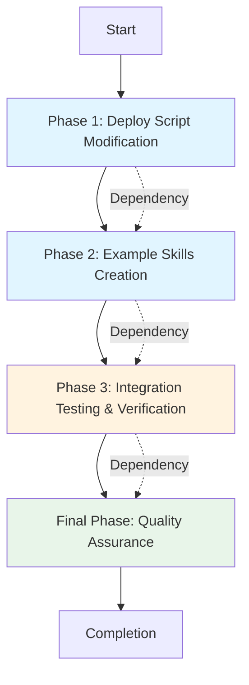
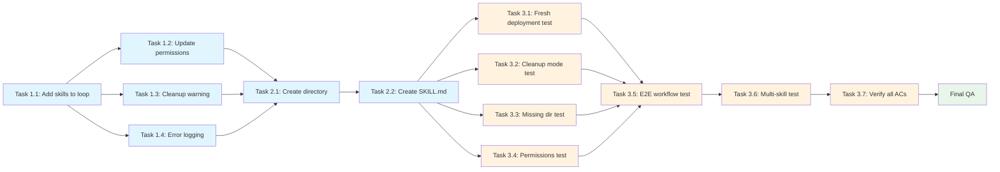

# Work Plan: Claude Skills Integration Implementation

Created Date: 2025-10-22
Type: feature
Estimated Duration: 1 day
Estimated Impact: 5 files
Related Issue/PR: N/A

## Related Documents

- Design Doc: [docs/design/claude-skills-integration.md](../design/claude-skills-integration.md) (Version 1.1 - Approved)
- ADR: N/A
- PRD: N/A

## Objective

Integrate Claude Skills deployment capability into the macOS dotfiles management system, enabling automated deployment of user-level Skills to `~/.claude/skills/` through the existing claude module infrastructure. This extends the current resource deployment pattern (agents, commands, tools, hooks, project-template) to include Skills, ensuring consistent Skills availability across machines.

## Background

The macOS dotfiles system currently deploys agents, commands, tools, hooks, and project-template to `~/.claude/`, but does not support Skills deployment. This integration adds Skills as a new resource type following the established deployment pattern, with specific handling for:
- Skills-specific cleanup warnings (to protect user-created skills)
- Nested directory permissions (skills contain subdirectories with supporting files)
- Example skill template for user guidance

## Risks and Countermeasures

### Technical Risks

- **Risk**: Cleanup mode removes user-created skills
  - **Impact**: High - Users may lose manually created skills
  - **Countermeasure**: Add skills-specific cleanup warning with explicit user confirmation before deletion (Design Doc Change 3)

- **Risk**: Permissions not set correctly for nested directory structures
  - **Impact**: Medium - Scripts in skill subdirectories may not be executable
  - **Countermeasure**: Use `find` command instead of glob pattern to handle nested directories (Design Doc Change 2)

- **Risk**: Skills directory creation fails
  - **Impact**: Medium - Skills not available, other resources unaffected
  - **Countermeasure**: Add error logging for copy failures (Design Doc Change 4)

- **Risk**: Skills conflict with commands namespace
  - **Impact**: Low - Potential confusion between skills and commands
  - **Countermeasure**: Skills and commands use different namespaces; documented in template skill

### Schedule Risks

- **Risk**: E2E testing requires manual Claude Code session verification
  - **Impact**: Low - Testing phase may take longer than expected
  - **Countermeasure**: Prepare clear verification steps in advance (included in Phase 3)

## Implementation Phases

### Phase 1: Deploy Script Modification (Estimated commits: 4)

**Purpose**: Implement core deployment infrastructure changes to modules/claude/apply.sh

#### Tasks

- [ ] Task 1.1: Add `skills` to resource loop (Design Doc Change 1, line 243)
  - Modify `for resource_type in agents commands tools hooks project-template` to include `skills`
  - Verify loop iteration includes skills deployment
  - AC: When apply.sh runs, skills directory is processed in resource loop

- [ ] Task 1.2: Update permissions handling for nested directories (Design Doc Change 2, line 259)
  - Replace chmod glob pattern with `find` command for skills
  - Use `find "$CLAUDE_CODE_SETTINGS_DIR/$resource_type" -type f \( -name "*.sh" -o -name "*.py" \) -exec chmod +x {} \;`
  - AC: Executable permissions set for .sh and .py files in nested skill directories

- [ ] Task 1.3: Add skills-specific cleanup warning (Design Doc Change 3, before cleanup loop)
  - Add cleanup warning with user confirmation for skills
  - Implement SKIP_SKILLS_CLEANUP flag to allow user to skip skills cleanup
  - AC: When cleanup mode enabled, user receives skills-specific warning and can opt out

- [ ] Task 1.4: Add error logging for copy failures (Design Doc Change 4, line 256)
  - Replace silent failure with error logging
  - Use `print_warning "Some $resource_type files may not have been copied completely"`
  - AC: When copy fails, user sees warning message but deployment continues

#### Phase Completion Criteria

- [ ] All 4 file changes implemented in modules/claude/apply.sh
- [ ] Code follows existing apply.sh patterns and conventions
- [ ] No syntax errors in modified shell script

#### Operational Verification Procedures

1. Run `sh modules/claude/apply.sh` without skills directory
   - Expected: No errors, deployment continues normally
2. Check apply.sh syntax: `sh -n modules/claude/apply.sh`
   - Expected: No syntax errors reported
3. Verify variable assignments and conditionals are correct
   - Expected: All variables properly quoted and conditionals use correct operators

### Phase 2: Example Skills Creation (Estimated commits: 1)

**Purpose**: Create template skill to provide user guidance and reference implementation

#### Tasks

- [ ] Task 2.1: Create modules/claude/skills/template-skill directory structure
  - Create `modules/claude/skills/template-skill/`
  - Verify directory permissions

- [ ] Task 2.2: Create template-skill/SKILL.md (Design Doc Change 5)
  - Implement YAML frontmatter with name and description
  - Add comprehensive instructions for skill creation
  - Include explanatory comments in frontmatter examples
  - Document skill structure and supporting files
  - AC: Template skill follows SKILL.md format specification from Design Doc

#### Phase Completion Criteria

- [ ] Template skill exists at modules/claude/skills/template-skill/SKILL.md
- [ ] SKILL.md contains valid YAML frontmatter
- [ ] Instructions are clear and comprehensive
- [ ] Examples include explanatory comments (Design Doc Issue-004 fix)

#### Operational Verification Procedures

1. Verify directory structure:
   ```bash
   ls -la modules/claude/skills/template-skill/SKILL.md
   ```
   - Expected: File exists with correct permissions
2. Validate YAML frontmatter syntax:
   ```bash
   head -n 10 modules/claude/skills/template-skill/SKILL.md
   ```
   - Expected: Valid YAML between `---` delimiters with name and description fields
3. Check content completeness:
   - Expected: Instructions, examples, and tips sections present

### Phase 3: Integration Testing & Verification (Estimated commits: 0)

**Purpose**: Execute manual integration and E2E tests to verify all acceptance criteria

#### Tasks

- [ ] Task 3.1: Integration Test - Fresh Deployment
  - Delete `~/.claude/skills/` if exists
  - Run `sh modules/claude/apply.sh`
  - Verify `~/.claude/skills/template-skill/SKILL.md` created
  - AC1: Skills deployed to ~/.claude/skills/ (Design Doc AC #1, #2)

- [ ] Task 3.2: Integration Test - Cleanup Mode
  - Deploy skills once
  - Modify template-skill/SKILL.md locally in ~/.claude/skills/
  - Enable cleanup mode and redeploy
  - Verify cleanup warning appears
  - Test both "confirm cleanup" and "skip cleanup" paths
  - AC3: Old skills removed in cleanup mode when user confirms (Design Doc AC #3)

- [ ] Task 3.3: Integration Test - Missing Skills Directory
  - Rename `modules/claude/skills/` to `modules/claude/skills.bak/`
  - Run `sh modules/claude/apply.sh`
  - Verify no errors occur
  - Restore directory
  - AC7: Deployment continues without error when skills directory doesn't exist (Design Doc AC #7)

- [ ] Task 3.4: Integration Test - Executable Permissions
  - Create test skill with helper.sh script in subdirectory
  - Deploy skills
  - Verify executable permissions:
     ```bash
     find ~/.claude/skills -name "*.sh" -o -name "*.py" | xargs ls -l
     ```
  - Expected: All scripts have executable bit set (-rwxr-xr-x)
  - AC4: Executable permissions set for .sh and .py files (Design Doc AC #4)

- [ ] Task 3.5: E2E Test - Complete Workflow
  - Deploy template skill
  - Start Claude Code session: `claude`
  - Verify skill loading (check console output if available)
  - Make request: "I need help creating a new Claude skill"
  - Verify Claude references template-skill in response
  - AC6: Deployed skills available for model-invoked use (Design Doc AC #6)

- [ ] Task 3.6: E2E Test - Multi-Skill Deployment
  - Create 2 additional test skills with different structures
  - Deploy all 3 skills
  - Verify directory structure preserved:
     ```bash
     find ~/.claude/skills -type f -name "SKILL.md"
     ```
  - Expected: 3 SKILL.md files listed
  - Verify all supporting files intact:
     ```bash
     ls -R ~/.claude/skills/
     ```
  - AC8: Multiple skills maintain their own directories with SKILL.md and supporting files (Design Doc AC #8)

- [ ] Task 3.7: Verify all 8 Design Doc acceptance criteria satisfied
  - AC1: Skills deployed to ~/.claude/skills/ (verified in Task 3.1)
  - AC2: All subdirectories copied (verified in Task 3.6)
  - AC3: Cleanup mode removes old skills (verified in Task 3.2)
  - AC4: Executable permissions set (verified in Task 3.4)
  - AC5: Success message displayed (verified in Task 3.1)
  - AC6: Skills available in Claude Code (verified in Task 3.5)
  - AC7: Continues without error when skills dir missing (verified in Task 3.3)
  - AC8: Multiple skills maintain structure (verified in Task 3.6)

#### Phase Completion Criteria

- [ ] All integration tests pass (6 test scenarios)
- [ ] All E2E tests pass (2 test scenarios)
- [ ] All 8 Design Doc acceptance criteria verified
- [ ] No errors or warnings during normal deployment flow
- [ ] Cleanup mode works correctly with user confirmation
- [ ] Skills available in Claude Code session

#### Operational Verification Procedures

**Integration Testing Point 1: Resource Loop Extension**
- Components: apply.sh resource loop → skills deployment
- Verification: Run `sh modules/claude/apply.sh`, confirm "skills deployed" success message appears
- Expected: Console output shows "Deploying skills..." and "skills deployed" messages

**Integration Testing Point 2: Cleanup Mode**
- Components: Cleanup mode flag → skills directory removal
- Verification: Deploy skills, enable cleanup mode, redeploy, confirm old skills removed
- Expected: Cleanup warning appears, user confirms, old skills removed before new deployment

**Integration Testing Point 3: Claude Code Runtime**
- Components: ~/.claude/skills/ → Claude Code session
- Verification: Start claude session, make request matching skill description, verify skill invoked
- Expected: Claude references skill in thinking/response when appropriate

**E2E Verification Steps (from Design Doc lines 459-504)**:

1. **Fresh Deployment Verification**:
   ```bash
   # Verify deployment
   ls -la ~/.claude/skills/template-skill/SKILL.md
   # Expected: File exists with correct permissions
   ```

2. **Claude Code Integration Verification**:
   ```bash
   # Start Claude Code session
   claude
   # Make request matching skill description
   # "Help me create a new Claude skill"
   # Verify Claude mentions template-skill or follows its instructions
   ```

3. **Multi-Skill Structure Verification**:
   ```bash
   # Verify directory structure
   find ~/.claude/skills -type f -name "SKILL.md"
   # Expected: All SKILL.md files listed

   # Verify supporting files preserved
   ls -R ~/.claude/skills/
   # Expected: All subdirectories and files intact

   # Verify executable permissions
   find ~/.claude/skills -name "*.sh" -o -name "*.py" | xargs ls -l
   # Expected: All scripts have executable bit set (-rwxr-xr-x)
   ```

### Final Phase: Quality Assurance (Required) (Estimated commits: 1)

**Purpose**: Overall quality assurance and Design Doc consistency verification

#### Tasks

- [ ] Verify all Design Doc acceptance criteria achieved (8 criteria)
- [ ] Code review: Verify changes follow existing apply.sh patterns
- [ ] Documentation check: Verify template skill is comprehensive
- [ ] No regression: Verify existing resource deployments (agents, commands, tools, hooks, project-template) still work
- [ ] Final deployment test: Run full `sh apply.sh` (select claude module) and verify success

#### Operational Verification Procedures

1. **Full Deployment Workflow**:
   ```bash
   # Run full apply script
   sh apply.sh
   # Select claude module
   # Verify all resources deployed including skills
   ```

2. **Regression Testing**:
   ```bash
   # Verify existing resources still work
   ls -la ~/.claude/agents/
   ls -la ~/.claude/commands/
   ls -la ~/.claude/skills/
   # Expected: All directories exist with correct content
   ```

3. **Skills Functionality Verification**:
   ```bash
   # Start Claude Code and verify skills are loaded
   claude
   # Make test request to invoke template skill
   # Expected: Claude can access and use the skill
   ```

## Phase Structure Diagram



## Task Dependency Diagram



## Completion Criteria

- [ ] All phases completed
- [ ] Each phase's operational verification procedures executed
- [ ] Design Doc acceptance criteria satisfied (8/8 criteria)
- [ ] All integration tests pass (6 test scenarios)
- [ ] All E2E tests pass (2 test scenarios)
- [ ] No regression in existing resource deployments
- [ ] Template skill provides comprehensive user guidance
- [ ] User review approval obtained

## Progress Tracking

### Phase 1: Deploy Script Modification

- Start: YYYY-MM-DD HH:MM
- Complete: YYYY-MM-DD HH:MM
- Notes: 4 file changes to modules/claude/apply.sh

### Phase 2: Example Skills Creation

- Start: YYYY-MM-DD HH:MM
- Complete: YYYY-MM-DD HH:MM
- Notes: Template skill created with comprehensive documentation

### Phase 3: Integration Testing & Verification

- Start: YYYY-MM-DD HH:MM
- Complete: YYYY-MM-DD HH:MM
- Notes: Manual testing - all 8 test scenarios verified

### Final Phase: Quality Assurance

- Start: YYYY-MM-DD HH:MM
- Complete: YYYY-MM-DD HH:MM
- Notes: Final verification and user approval

## Notes

### Design Doc Compliance

This work plan strictly follows the approved Design Document (Version 1.1):
- All tasks map 1:1 with "File Changes Required" section (5 changes)
- Implementation order follows "Required Implementation Order" (lines 377-392)
- Test tasks derived from "Test Strategy" section (lines 417-509)
- Acceptance criteria taken directly from Design Doc (lines 82-91)

### Implementation Strategy

Selected approach: **Horizontal Slice (Layer-based implementation)** as specified in Design Doc:
- All skills share the same deployment mechanism
- Changes concentrated in apply.sh and directory structure
- Foundation must be complete before skills can be deployed

### Critical Success Factors

1. **No Speculation**: All tasks based solely on approved Design Doc specifications
2. **Atomic Commits**: Each task produces one logical commit
3. **Test Coverage**: Both integration and E2E tests required
4. **User Safety**: Skills-specific cleanup warning protects user-created skills
5. **Pattern Consistency**: Follows existing resource deployment patterns

### Testing Notes

- Integration tests are manual (shell script deployment)
- E2E tests require Claude Code session verification
- All 8 acceptance criteria must be verified before completion
- Cleanup mode testing requires both confirmation and cancellation paths

### Risk Mitigation Status

- Cleanup warning implemented (protects user-created skills)
- Find command used for nested permissions (handles subdirectories)
- Error logging added (provides visibility into failures)
- Template skill provides user guidance (reduces confusion with commands)
