# Claude Code Development Workflows

**Professional development workflows for Claude Code** - Complete implementation lifecycle management from requirements analysis to deployment, powered by specialized sub-agents and quality assurance patterns.

---

## ⚡ Quick Start

```bash
# 1. Deploy to your system
cd /path/to/dotfiles
sh apply.sh
# Select "claude" module

# 2. Start Claude Code
claude

# 3. Run a complete implementation workflow
/dev:implement "Add user authentication feature"

# 4. Or execute specific phases
/dev:design "Add user authentication feature"   # Design phase only
/dev:plan                                       # Planning phase only
/dev:build                                      # Implementation phase only
/dev:review                                     # Post-implementation review
```

---

## 🔧 How It Works

### Intelligent Workflow Orchestration

This framework orchestrates specialized sub-agents through different phases of development:

```mermaid
graph TB
    A[👤 User Request] --> B[🔍 requirement-analyzer]

    B --> |"📦 Large (6+ files)"| C[📄 prd-creator]
    B --> |"📦 Medium (3-5 files)"| D[📐 technical-designer]
    B --> |"📦 Small (1-2 files)"| E[⚡ Direct Implementation]

    C --> F[document-reviewer]
    F --> D
    D --> G[document-reviewer]
    G --> H[📐 technical-designer Design Doc]
    H --> I[document-reviewer]
    I --> J[🧪 acceptance-test-generator]
    J --> K[📋 work-planner]
    K --> L[✂️ task-decomposer]

    L --> M[🔨 task-executor Loop]
    E --> M

    M --> N[✅ quality-fixer]
    N --> O[📝 Git Commit]
    O --> P{More tasks?}
    P --> |Yes| M
    P --> |No| Q[🎉 Complete]
```



### Execution Flow

1. **Analysis**: `requirement-analyzer` assesses task complexity and requirements
2. **Planning**: Generate appropriate documentation (PRD → ADR → Design Doc → Work Plan)
3. **Execution**: Specialized agents handle each phase autonomously
4. **Quality**: Automated testing, type checking, and error fixing with `quality-fixer`
5. **Review**: `code-reviewer` verifies compliance and completeness
6. **Commit**: Clean, production-ready code with atomic commits

---

## ⚡ Workflow Commands

Streamline your development with purpose-built commands:

### `/dev:implement` - End-to-End Implementation

**Purpose**: Complete feature development from requirements to deployment

**When to use**:

- New features requiring complete lifecycle
- Changes affecting multiple files
- Complex modifications requiring design documents

**What it does**:

1. Analyzes requirements with `requirement-analyzer`
2. Creates necessary documents (PRD/ADR/Design Doc/Work Plan) based on scale
3. Generates test skeletons with `acceptance-test-generator`
4. Decomposes work into atomic tasks with `task-decomposer`
5. **Enters autonomous mode** after batch approval:
   - Executes each task with `task-executor`
   - Runs quality checks with `quality-fixer`
   - Creates atomic git commits
6. Stops at requirement changes or escalations

**Example**:

```bash
/dev:implement "Add JWT authentication to API endpoints"
```

---

### `/dev:task` - Single Task Execution

**Purpose**: Execute single task with metacognitive rule selection

**When to use**:

- Bug fixes
- Small enhancements (1-2 files)
- Quick modifications

**What it does**:

1. Invokes `rule-advisor` for metacognitive analysis
2. Selects appropriate coding/testing rules
3. Creates task structure with TodoWrite
4. Executes implementation following selected rules

**Example**:

```bash
/dev:task "Fix validation error message for email field"
```

---

### `/dev:design` - Design Documentation

**Purpose**: Create technical design documents from requirements

**When to use**:

- Architecture planning before implementation
- Evaluating technical options
- Documenting complex changes

**What it does**:

1. Analyzes requirements with `requirement-analyzer`
2. Creates PRD (if large scale)
3. Creates ADR (if architecture changes)
4. Creates Design Doc with acceptance criteria
5. Reviews with `document-reviewer`
6. Stops after design approval

**Example**:

```bash
/dev:design "Implement caching layer for API responses"
```

---

### `/dev:plan` - Work Planning

**Purpose**: Generate work plan from design document

**When to use**:

- After design approval
- Breaking down complex implementations
- Planning task execution order

**What it does**:

1. Loads existing design documents
2. Optionally generates E2E test skeletons with `acceptance-test-generator`
3. Creates work plan with `work-planner`
4. Stops after plan approval

**Example**:

```bash
/dev:plan  # Uses latest design document
```

---

### `/dev:build` - Implementation Execution

**Purpose**: Execute decomposed tasks in autonomous mode

**When to use**:

- After work plan approval
- Resuming interrupted implementation
- Executing planned tasks

**What it does**:

1. Checks for existing task files in `docs/plans/tasks/`
2. If no tasks exist, runs `task-decomposer` to generate them
3. **Enters autonomous mode**:
   - Per-task cycle: `task-executor` → `quality-fixer` → `git commit`
   - ONE task at a time (never batches)
   - Stops on requirement changes or escalations
4. Reports completion with metrics

**Example**:

```bash
/dev:build  # Executes tasks from latest work plan
```

**Critical Rules**:

- Quality-fixer MUST run after each task-executor
- Commit MUST execute when quality-fixer returns `approved: true`
- Never skip quality checks or defer commits

---

### `/dev:review` - Compliance Validation

**Purpose**: Verify implementation against Design Doc

**When to use**:

- Post-implementation quality check
- Before merging to main branch
- Validating acceptance criteria fulfillment

**What it does**:

1. Loads latest Design Doc
2. Validates implementation with `code-reviewer`
3. Calculates compliance rate
4. Optionally auto-fixes issues with `task-executor` + `quality-fixer`
5. Reports final compliance metrics

**Example**:

```bash
/dev:review  # Reviews against latest Design Doc
```

**Compliance Thresholds**:

- **90%+**: Production ready
- **70-89%**: Needs improvement
- **<70%**: Consider redesign

---

## 📦 Specialized Sub-Agents

11 production-ready agents for every phase of development:

### Planning & Analysis Agents

#### `requirement-analyzer`

- **Purpose**: Analyze requirements and determine work scale
- **Outputs**: Scale determination (Small/Medium/Large), required documents (PRD/ADR/Design Doc)
- **Called by**: `/dev:implement`, `/dev:design`

#### `prd-creator`

- **Purpose**: Create Product Requirements Documents
- **Modes**: `create`, `update`, `reverse-engineer`
- **Called by**: `/dev:implement` (large scale only)

#### `technical-designer`

- **Purpose**: Create Architecture Decision Records (ADR) and Design Documents
- **Features**: Latest tech research with WebSearch, integration point analysis
- **Called by**: `/dev:implement`, `/dev:design`

#### `work-planner`

- **Purpose**: Break down design into executable tasks
- **Features**: TDD workflow, phase composition, dependency management
- **Called by**: `/dev:implement`, `/dev:plan`

#### `task-decomposer`

- **Purpose**: Decompose work plans into atomic tasks (1 commit = 1 task)
- **Outputs**: Task files in `docs/plans/tasks/`
- **Called by**: `/dev:build`

### Execution Agents

#### `task-executor`

- **Purpose**: Execute individual tasks following TDD (Red-Green-Refactor)
- **Authority**: Implementation and test creation
- **Out of scope**: Overall quality checks (delegated to quality-fixer)
- **Called by**: `/dev:build`, `/dev:review` (auto-fix mode)

#### `quality-fixer`

- **Purpose**: Comprehensive quality assurance and automatic error fixing
- **Features**: Lint, format, build, all tests, type checking
- **Continues until**: All checks pass OR blocked condition
- **Called by**: `/dev:build` (after each task-executor)

### Testing Agents

#### `acceptance-test-generator`

- **Purpose**: Generate separate integration and E2E test skeletons from Design Doc ACs
- **Outputs**:
  - `*.int.test.*` - Integration tests (created with implementation)
  - `*.e2e.test.*` - E2E tests (executed in final phase)
- **Called by**: `/dev:plan`

### Review Agents

#### `code-reviewer`

- **Purpose**: Validate Design Doc compliance post-implementation
- **Features**: Quantitative compliance scoring, gap identification
- **Called by**: `/dev:review`

#### `document-reviewer`

- **Purpose**: Review document consistency and completeness
- **Modes**: `composite` (recommended) - multi-angle verification
- **Called by**: After PRD/ADR/Design Doc creation

### Meta-Cognitive Agents

#### `rule-advisor`

- **Purpose**: Select appropriate rulesets to maximize AI execution accuracy
- **Features**: Task analysis, metacognitive support, rule file loading
- **Called by**: `/dev:task`, task-executor (implicitly)

---

## 📚 Rule Files and Resources

All sub-agents reference shared rule files for consistency:

### Core Rule Files (in `~/.claude/agents/rules/`)

- **`coding-principles.md`**: Language-agnostic coding standards
- **`testing-principles.md`**: TDD, coverage, test patterns
- **`ai-development-guide.md`**: AI development guidelines, pre-implementation investigation
- **`documentation-criteria.md`**: Documentation standards and storage locations
- **`rules-index.yaml`**: Rule file metadata for rule-advisor

### Architecture Rules (in `~/.claude/agents/rules/architecture/`)

- **`implementation-approach.md`**: Metacognitive strategy selection (Vertical/Horizontal/Hybrid)

### Guides (in `~/.claude/agents/guides/`)

- **`sub-agents.md`**: Orchestration guidelines for Claude (workflow definitions)

### Templates (in `~/.claude/agents/templates/`)

- **`prd-template.md`**: Product Requirements Document template
- **`adr-template.md`**: Architecture Decision Record template
- **`design-template.md`**: Design Document template
- **`plan-template.md`**: Work Plan template

---

## 🎯 Typical Workflows

### Workflow 1: Feature Development (Large Scale)

**Scenario**: "Add user authentication with JWT"

```bash
/dev:implement "Add JWT authentication with role-based access control"

# Automatically:
# 1. requirement-analyzer → Scale: Large (8+ files)
# 2. prd-creator → Creates PRD in docs/prd/
# 3. document-reviewer → Reviews PRD
#    [Stop: PRD Approval]
# 4. technical-designer → Creates ADR for JWT vs Session
# 5. document-reviewer → Reviews ADR
#    [Stop: ADR Approval]
# 6. technical-designer → Creates Design Doc
# 7. document-reviewer → Reviews Design Doc
#    [Stop: Design Doc Approval]
# 8. acceptance-test-generator → Creates test skeletons
# 9. work-planner → Creates work plan
#    [Stop: Batch approval for entire implementation phase]
# 10. Autonomous mode starts:
#     - task-decomposer → Generates atomic tasks
#     - For each task:
#       - task-executor → Implements with TDD
#       - quality-fixer → All quality checks
#       - Git commit
# 11. Completion report
```

### Workflow 2: Bug Fix or Small Change

**Scenario**: "Fix email validation error message"

```bash
/dev:task "Fix validation error message to be more user-friendly"

# Automatically:
# 1. rule-advisor → Selects coding/testing rules
# 2. Creates TodoWrite task structure
# 3. Implements fix following selected rules
# 4. quality-fixer → Verifies quality
```

### Workflow 3: Design-First Approach

**Scenario**: Planning before implementation

```bash
# Step 1: Create design
/dev:design "Implement Redis caching for API responses"
# → Creates PRD (if needed), ADR, Design Doc
# [Stop: Design Doc Approval]

# Step 2: Create work plan
/dev:plan
# → Generates test skeletons, creates work plan
# [Stop: Plan Approval]

# Step 3: Execute implementation
/dev:build
# → Autonomous execution of all tasks
```

### Workflow 4: Post-Implementation Review

**Scenario**: Verify implementation completeness

```bash
/dev:review

# Automatically:
# 1. Loads latest Design Doc
# 2. code-reviewer → Validates compliance
# 3. Reports compliance rate (e.g., 85%)
# 4. If <90%, offers auto-fix:
#    - rule-advisor → Metacognitive analysis
#    - TodoWrite → Task structure
#    - task-executor → Staged fixes
#    - quality-fixer → Quality verification
# 5. Re-validates → Final compliance report
```

---

## 💡 Real-World Examples

### Example 1: API Endpoint Implementation

```bash
/dev:implement "Add REST API endpoints for user profile management (CRUD)"

# Result:
# - PRD created (10 user stories)
# - Design Doc with API specifications
# - Work Plan with 5 phases
# - 12 atomic tasks generated
# - All tasks implemented with TDD
# - 95% test coverage
# - All quality checks passed
# - 12 atomic commits
# - Time: ~2-3 hours (autonomous)
```

### Example 2: Performance Optimization

```bash
/dev:design "Optimize database queries with caching layer"

# Result:
# - ADR comparing Redis vs Memcached
# - Design Doc with caching strategy
# - Integration point analysis
# - Performance metrics definition
# - Ready for implementation approval
```

### Example 3: Bug Fix with Quality Assurance

```bash
/dev:task "Fix race condition in concurrent user registration"

# Result:
# - Rule-advisor selects concurrency rules
# - TodoWrite structures investigation → fix → test
# - Implements fix with proper locking
# - Adds regression test
# - Quality-fixer verifies all tests pass
# - Single atomic commit
```

---

## 🛡️ Key Concepts

### Autonomous Execution Mode

**Trigger**: Batch approval for entire implementation phase

**Behavior**:

- Executes tasks sequentially without user intervention
- Per-task cycle: `task-executor` → `quality-fixer` → `commit`
- ONE task at a time (never batches multiple tasks)

**Stops when**:

- Requirement changes detected
- Sub-agent escalates with `status: "escalation_needed"`
- User explicitly interrupts

**Authority Delegation**:

- `task-executor`: Implementation authority (can use Edit/Write)
- `quality-fixer`: Fix authority (automatic quality error fixes)

### Scale-Based Workflows

| Scale      | File Count | PRD               | ADR             | Design Doc  | Work Plan   | Test Skeleton |
| ---------- | ---------- | ----------------- | --------------- | ----------- | ----------- | ------------- |
| **Small**  | 1-2        | Update\*          | -               | -           | Simplified  | -             |
| **Medium** | 3-5        | Update\*          | Conditional\*\* | ✅ Required | ✅ Required | ✅ Required   |
| **Large**  | 6+         | ✅ Required\*\*\* | Conditional\*\* | ✅ Required | ✅ Required | ✅ Required   |

\* Update if PRD exists for the feature
\*\* When architecture changes, new technology, or data flow changes
\*\*\* New creation/update existing/reverse-engineer (when no existing PRD)

### Quality Assurance Cycle

Every task goes through mandatory quality gates:

```
Task → task-executor → quality-fixer → [All Checks Pass?]
                           ↓               ↓
                        Fix Loop        Commit
```

**quality-fixer checks**:

1. Linting and formatting
2. Static analysis (type checking)
3. Build success
4. All tests pass (unit + integration)
5. Coverage (optional)

**Never proceeds to commit unless**: `approved: true`

### TDD (Test-Driven Development)

All implementation follows Red-Green-Refactor:

1. **Red**: Write failing test FIRST
2. **Green**: Minimal implementation to pass
3. **Refactor**: Improve code quality
4. **Verify**: Confirm tests still pass

**Test Types**:

- **Unit tests**: RED-GREEN-REFACTOR cycle per test
- **Integration tests**: Create and execute with implementation
- **E2E tests**: Execute only (in final phase after all implementation)

---

## 📂 Directory Structure

This framework generates the following directory structure:

```
your-project/
├── docs/
│   ├── prd/                    # Product Requirements Documents
│   │   └── [feature]-prd.md
│   ├── adr/                    # Architecture Decision Records
│   │   ├── ADR-0001-*.md
│   │   └── ADR-COMMON-*.md    # Common technical decisions
│   ├── design/                 # Design Documents
│   │   └── [feature]-design.md
│   └── plans/                  # Work Plans
│       ├── [date]-[feature].md
│       ├── tasks/              # Atomic Tasks
│       │   ├── _overview-*.md  # Overall design document
│       │   ├── *-task-01.md
│       │   └── *-phase1-completion.md
│       └── analysis/           # Research deliverables
│           └── research-results.md
├── src/                        # Implementation
└── tests/                      # Tests
    ├── *.test.*                # Unit tests
    ├── *.int.test.*            # Integration tests
    └── *.e2e.test.*            # E2E tests
```

---

## 🎓 Best Practices

### 1. Let the Framework Guide You

✅ **Do**:

- Use `/dev:implement` for new features
- Trust autonomous execution mode
- Let sub-agents handle their responsibilities
- Follow the stop points for approval

❌ **Don't**:

- Skip design phase for medium/large changes
- Manually batch multiple tasks
- Skip quality checks
- Bypass approval gates

### 2. Leverage Metacognition

The `rule-advisor` agent provides metacognitive support:

- Understands task essence (not just surface work)
- Identifies past failure patterns
- Selects appropriate rules
- Provides first action guidance

**Always trust**: rule-advisor's analysis and follow recommendations

### 3. Atomic Commits

Each task = 1 logical commit:

- Clear, descriptive commit messages
- Complete feature/fix/refactor
- All quality checks passed
- Independently revertible

**Commit message format** (auto-generated):

```
[type]: [concise summary]

[detailed description]

🤖 Generated with [Claude Code](https://claude.com/claude-code)

Co-Authored-By: Claude <noreply@anthropic.com>
```

### 4. Escalation Handling

Sub-agents escalate when they need human judgment:

**Design deviation**:

```json
{
  "status": "escalation_needed",
  "reason": "Design Doc deviation",
  "suggested_options": [...]
}
```

**Action**: Review options, make decision, continue

**Similar function found**:

```json
{
  "status": "escalation_needed",
  "reason": "Similar function discovered",
  "similar_functions": [...]
}
```

**Action**: Choose to extend existing, refactor, or create new

---

## 🔧 Configuration

### Deployment

This framework is deployed to `~/.claude/` when you run:

```bash
sh apply.sh
# Select "claude" module
```

**Deployed structure**:

```
~/.claude/
├── agents/                     # Sub-agent definitions
│   ├── requirement-analyzer.md
│   ├── task-executor.md
│   ├── quality-fixer.md
│   ├── ... (11 agents total)
│   ├── guides/                 # Orchestration guides
│   │   └── sub-agents.md
│   ├── rules/                  # Shared rule files
│   │   ├── coding-principles.md
│   │   ├── testing-principles.md
│   │   ├── ai-development-guide.md
│   │   ├── documentation-criteria.md
│   │   ├── rules-index.yaml
│   │   └── architecture/
│   │       └── implementation-approach.md
│   └── templates/              # Document templates
│       ├── prd-template.md
│       ├── adr-template.md
│       ├── design-template.md
│       └── plan-template.md
└── commands/
    └── dev/                    # Workflow commands
        ├── implement.md
        ├── task.md
        ├── design.md
        ├── plan.md
        ├── build.md
        ├── review.md
        └── README.md (this file)
```

### Customization

You can customize the framework by:

1. **Editing rule files**: Modify `~/.claude/agents/rules/*.md`
2. **Adding project-specific architecture rules**: Create files in `~/.claude/agents/rules/architecture/`
3. **Customizing templates**: Edit files in `~/.claude/agents/templates/`
4. **Adjusting agents**: Modify agent definitions in `~/.claude/agents/*.md`

**Note**: Changes to `~/.claude/` persist until next deployment. To make permanent changes, edit source files in `modules/claude/` and redeploy.

---

## 🐛 Troubleshooting

### Issue: Sub-agents not found

**Symptoms**: "Agent not found" or "rule file not found" errors

**Solution**:

```bash
# Redeploy claude module
cd /path/to/dotfiles
sh apply.sh
# Select "claude" module
# Enable cleanup mode when prompted
```

**Verify**:

```bash
ls -la ~/.claude/agents/
# Should show all 11 agent files + guides/ + rules/ + templates/
```

### Issue: Rules/templates not loading

**Symptoms**: Agents report missing rule files

**Solution**:

```bash
# Check if subdirectories exist
ls -la ~/.claude/agents/rules/
ls -la ~/.claude/agents/templates/
ls -la ~/.claude/agents/guides/

# If missing, redeploy with cleanup
cd /path/to/dotfiles
sh modules/claude/apply.sh
# Select cleanup mode
```

### Issue: Quality-fixer not running

**Symptoms**: Commits without quality checks

**Solution**: This is a critical workflow violation. The orchestrator should ALWAYS run quality-fixer after task-executor.

**Check**:

- Are you using `/dev:build`? (Should auto-run quality-fixer)
- Manual implementation? (Always run `/dev:review` before commit)

### Issue: Autonomous mode not stopping

**Symptoms**: Continues despite requirement changes

**Solution**:

- Explicitly interrupt with user message
- State requirement changes clearly
- The orchestrator should detect and stop

### Issue: Document not found

**Symptoms**: Commands can't find PRD/ADR/Design Doc

**Solution**:

```bash
# Check standard locations
ls docs/prd/
ls docs/adr/
ls docs/design/

# If missing, may need to run design phase first
/dev:design "your requirement"
```

---

## 📖 Additional Resources

### Official Documentation

- **Claude Code Docs**: https://docs.claude.com/en/docs/claude-code/
- **Sub-agents Guide**: https://docs.claude.com/en/docs/claude-code/sub-agents
- **Slash Commands**: https://docs.claude.com/en/docs/claude-code/slash-commands

### Framework Source

This framework is based on **claude-code-workflows** by shinpr:

- **Repository**: https://github.com/shinpr/claude-code-workflows
- **Plugin**: Available on Claude Code plugin marketplace

### Related Workflows

- **Git Commands**: `/git:commit`, `/git:pr-create`, `/git:pr-review`
- **PRP Commands**: `/prp:init`, `/prp:create`, `/prp:execute`
- **Hook Commands**: `/hooks:setup-hooks`
